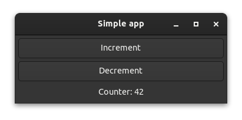

<h1>
  <a href="https://relm4.org">
    
  </a>
</h1>

[](https://github.com/Relm4/Relm4/actions/workflows/rust.yml)
[](https://matrix.to/#/#relm4:matrix.org)
[](https://crates.io/crates/relm4)
[](https://docs.rs/relm4/)
[](https://relm4.org/book/stable/)

[](https://deps.rs/repo/github/Relm4/Relm4)

An idiomatic GUI library inspired by [Elm](https://elm-lang.org/) and based on [gtk4-rs](https://crates.io/crates/gtk4). 
Relm4 is a new version of [relm](https://github.com/antoyo/relm) that's built from scratch and is compatible with [GTK4](https://www.gtk.org/) and [libadwaita](https://gitlab.gnome.org/GNOME/libadwaita).

## Why Relm4

We believe that GUI development should be easy, productive and delightful.  
The [gtk4-rs](https://crates.io/crates/gtk4) crate already provides everything you need to write modern, beautiful and cross-platform applications.
Built on top of this foundation, Relm4 makes developing more idiomatic, simpler and faster and enables you to become productive in just a few hours.

## Our goals

+ ⏱️ **Productivity**
+ ✨ **Simplicity**
+ 📎 **Outstanding documentation**
+ 🔧 **Maintainability**

## Documentation

+ 📖 **[The Relm4 book](https://relm4.org/book/stable/)**
+ 📜 **[Rust documentation](https://docs.rs/relm4/)**

## Dependencies

Relm4 depends on GTK4: [How to install GTK4 and Rust](https://gtk-rs.org/gtk4-rs/git/book/installation.html)

## Ecosystem

+ [relm4-macros](https://crates.io/crates/relm4-macros) - several macros for declarative UI definitions.
+ [relm4-components](https://crates.io/crates/relm4-components) - a collections of reusable components.
+ [relm4-icons](https://crates.io/crates/relm4-icons) - icons for your application.
+ [relm4-template](https://github.com/Relm4/relm4-template) - a starter template for creating Relm4 applications in the Flatpak package format.
+ [relm4-snippets](https://github.com/Relm4/vscode-relm4-snippets) - code snippets to speed up your development.

Use this in to your `Cargo.toml`:

```toml
# Core library
relm4 = "0.8"
# Optional: reusable components
relm4-components = "0.8"
# Optional: icons
relm4-icons = { version = "0.8.0", features = ["plus"] }
```

### Features

The `relm4` crate has four feature flags:

| Flag | Purpose | Default |
| :--- | :------ | :-----: |
| `macros` | Enable macros by re-exporting [`relm4-macros`](https://crates.io/crates/relm4-macros) | ✅ |
| `libadwaita` | Improved support for [libadwaita](https://gitlab.gnome.org/World/Rust/libadwaita-rs) | - |
| `libpanel` | Improved support for [libpanel](https://gitlab.gnome.org/World/Rust/libpanel-rs) | - |
| `dox` | Linking to the underlying C libraries is skipped to allow building the docs without dependencies | - |
| `gnome_44` | Enable all version feature flags of all dependencies to match the GNOME 44 SDK | - |
| `gnome_43` | Enable all version feature flags of all dependencies to match the GNOME 43 SDK | - |
| `gnome_42` | Enable all version feature flags of all dependencies to match the GNOME 42 SDK | ✅ |

The `macros` feature is a default feature.

## Examples

Several example applications are available at [examples/](examples/).

#### [📸 Screenshots from the example apps](assets/screenshots)

### A simple counter app




```rust
use gtk::prelude::*;
use relm4::prelude::*;

struct App {
    counter: u8,
}

#[derive(Debug)]
enum Msg {
    Increment,
    Decrement,
}

#[relm4::component]
impl SimpleComponent for App {
    type Init = u8;
    type Input = Msg;
    type Output = ();

    view! {
        gtk::Window {
            set_title: Some("Simple app"),
            set_default_size: (300, 100),

            gtk::Box {
                set_orientation: gtk::Orientation::Vertical,
                set_spacing: 5,
                set_margin_all: 5,

                gtk::Button {
                    set_label: "Increment",
                    connect_clicked => Msg::Increment,
                },

                gtk::Button {
                    set_label: "Decrement",
                    connect_clicked => Msg::Decrement,
                },

                gtk::Label {
                    #[watch]
                    set_label: &format!("Counter: {}", model.counter),
                    set_margin_all: 5,
                }
            }
        }
    }

    // Initialize the component.
    fn init(
        counter: Self::Init,
        root: Self::Root,
        sender: ComponentSender<Self>,
    ) -> ComponentParts<Self> {
        let model = App { counter };

        // Insert the code generation of the view! macro here
        let widgets = view_output!();

        ComponentParts { model, widgets }
    }

    fn update(&mut self, msg: Self::Input, _sender: ComponentSender<Self>) {
        match msg {
            Msg::Increment => {
                self.counter = self.counter.wrapping_add(1);
            }
            Msg::Decrement => {
                self.counter = self.counter.wrapping_sub(1);
            }
        }
    }
}

fn main() {
    let app = RelmApp::new("relm4.example.simple");
    app.run::<App>(0);
}
```

## Projects using Relm4

- [fm](https://github.com/euclio/fm) — A small, general-purpose file manager.
- [Done](https://github.com/edfloreshz/done) - A simple and versatile to do app.
- [Reovim](https://github.com/songww/reovim) - GUI frontend for neovim.
- [NixOS Configuration Editor](https://github.com/vlinkz/nixos-conf-editor) - A graphical configuration editor for [NixOS](https://nixos.org).
- [Rhino Setup](https://github.com/rhino-linux/rhino-setup) - Setup wizard for [Rolling Rhino](https://rhinolinux.org/)
- [Lemoa](https://github.com/lemmy-gtk/lemoa) - Desktop client for Lemmy
- [Score Tracker](https://github.com/weclaw1/score-tracker) - App for tracking player scores in card and board games

## License

Licensed under either of

 * Apache License, Version 2.0, ([LICENSE-APACHE](LICENSE-APACHE) or http://www.apache.org/licenses/LICENSE-2.0)
 * MIT license ([LICENSE-MIT](LICENSE-MIT) or http://opensource.org/licenses/MIT)

at your option.

### Contribution

Unless you explicitly state otherwise, any contribution intentionally submitted
for inclusion in the work by you, as defined in the Apache-2.0 license, shall be dual licensed as above, without any
additional terms or conditions.

**Feedback and contributions are highly appreciated!**
